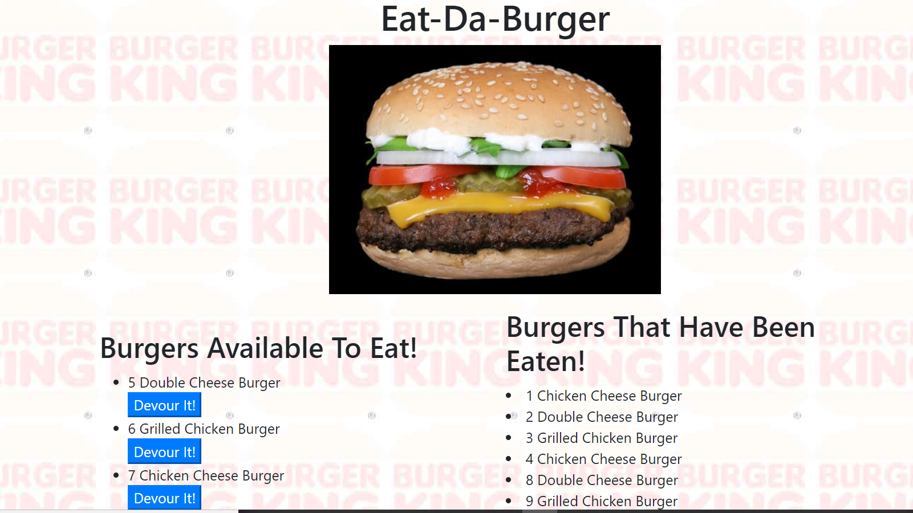
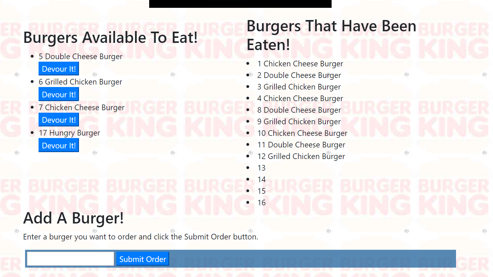

# Eat-Da-Burger

This is an activity to add burgers and devour burgers when clicking on buttons.  "Eat-Da-Burger" is a full-stack site that will use  MySQL, Node, Express, Handlebars and  ORM . It will follow the MVC design pattern; use Node and MySQL to query and route data in the app, and Handlebars to generate the HTML.

**Files needed:**
Eat-Da-Burger

>-app  
>-data  
>-burger.js  
>-public  
>-main.handlebars
>-index.handlebars  
>-connection.js  
>-orm.js
>-burgers-controller.js
>-schemal.sql
>-seeds.sql  
>-node_modules  
>-package.json  
>-server.js

**What does the app do?**

1. The user will enter a new burger or select a burger to eat.

2. The new burger will display on the screen as a selection with the burger name submitted.

3. The burger eaten will be listed as devoured.

**Example:

![App screenshot]

**Technologies used:**
>apis  
>express  
>github  
>heroku  
>handlebars
>orm  
>javascript  
>bootstrap

**How did it run?**
(The app interface works well.) All buttons connect and allow the user to devour burgers and to add a new burger.
![submitorder]
Eat-Da-Burger is a fun app to devour and submit a burger order.

Anita McFarland